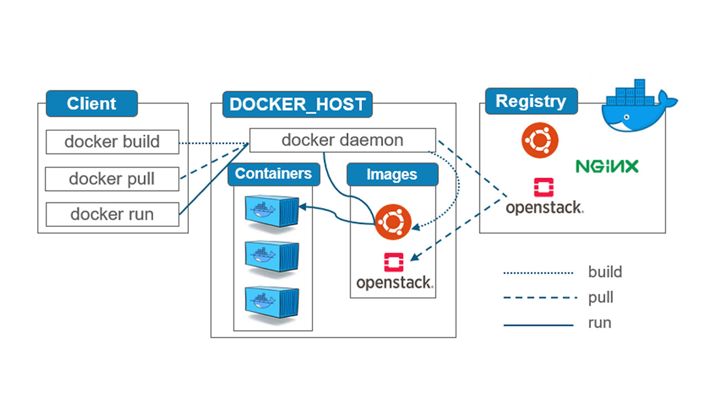

# Docker summary

## Content:
  - [Docker](#docker)
  - [Container](#container)
  - [Image](#image)
  - [Registry](#registry)
  - [Docker Client](#client)
  - [Docker Daemon](#daemon)
  - [Docker Architecture](#architecture)
  - [Docker Commands](#commands)

**<a name="docker">
Docker
</a>**
- Is a free software, allows users to create isolated environments to launch and deploy its applications.
- These are called containers.

**<a name="container">
Container
</a>**
 - Runnable instance of an image.
 - You can start, stop, or remove.

**<a name="image">
Image
</a>**

- Template with instructions for creating docker container.
- You may build your image.

**<a name="registry">
Registry
</a>**

- Stores docker images.
- Docker hub is the default public registry.

**<a name="client">
Docker Client
</a>**
  - is the primary way that many Docker users interact with Docker.

**<a name="daemon">
Docker Daemon
</a>**

- listens for Docker API requests and manages Docker objects such as images, containers, networks, and volumes.

**<a name="architecture">
Docker Architecture
</a>**

**<a name="commands">
Docker Commands
</a>**

- List all containers
  
  - `docker container ls`  **List currently running containers**
  - `docker container ls -a` **List all docker containers (running and stopped)**
  - `docker ps`
  - `docker ps -a`

- Remove a stopped container
  - `docker container rm <container_name>`
  - `docker rm <container_name>`
    
- Delete all containers (only if stopped)
    - `docker rm $(docker ps -a -q)`  
- Start or stop an existing container
   - `docker start|stop <container_name> (or <container-id>)`

- Stop all running containers
 - `docker stop $(docker ps -a -q)`

- Create and run a container from an image, with a custom name
  - `docker run --name <container_name> <image_name>`
  
- Run a container in the background
  - `docker run -d <image_name>`  
  
- Run a container with and publish a container’s port(s) to the host
   - `docker run -p <host_port>:<container_port> <image_name>`
  
- List all images
    - `docker images`
  
- Delete an Image
   - `docker image rm <image_name>`
   - `docker rmi <image_name>`

- Delete all existing images
 - `docker image rm $(docker images -a -q)`

- Remove all unused images
  - `docker image prune`

- Pull an image from a Docker Hub
  - `docker pull <image_name>`

- Inspect a running container
  - `docker inspect <container_name> (or <container_id>)`

- Fetch the logs of a container:
  - `docker logs <container_name>`

- Display a live stream of container(s) resource usage statistics
  - `docker stats <container_name> (or <container_id>)`
  - `docker stats` ** all containers**

- Display system-wide information meemory, cpu, version, images, containers count
  - `docker info`

- Run Container with full example
  `docker run -d -p 80:80 --name n1 ngnix`

- Docker-compose
  - `docker-compose start`
  - `docker-compose stop`
  - `docker-compose pause`
  - `docker-compose unpause`
  - `docker-compose ps`
  - `docker-compose up`
  - `docker-compose down`